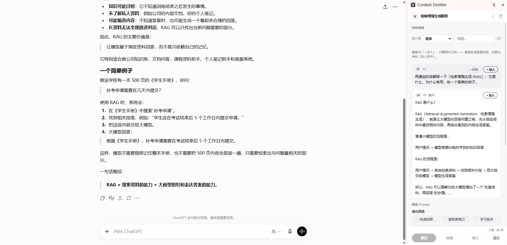
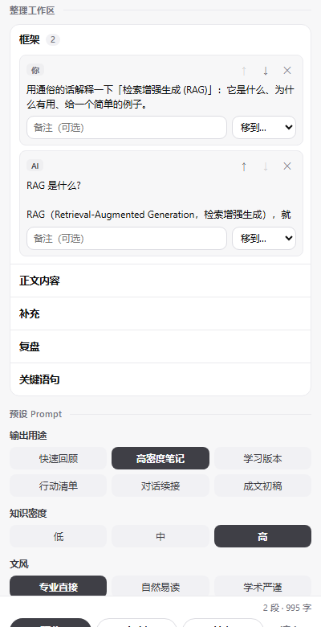
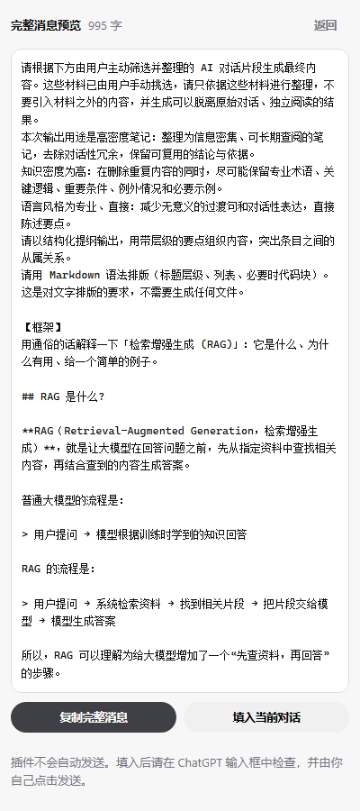

<div align="center">


# Context Distiller

**一个运行在 AI 对话页面旁边的临时「选材 + Prompt 编译」工作台**

在你把材料交给 AI 之前，把材料的**选择权、组织权和生成指令的控制权**交回给你。


</div>

<div align="center">



<sub>真实运行截图 · 停靠在 ChatGPT 对话旁读取当前对话 · 划词 / 整条选材（侧边栏自动去除 Markdown 标记，阅读干净）</sub>

<br /><br />


&nbsp;&nbsp;


<br />

<sub>模块编组 + 预设 Prompt&nbsp;&nbsp;·&nbsp;&nbsp;预览确定性编译出的完整提示词（编译输出保留原始 Markdown）</sub>

</div>

---

## 这是什么

Context Distiller 解决的不是「让插件自己总结对话」，而是「在把材料交给 AI 之前，让**你**掌握
控制权」。它在长对话与最终生成之间，加了一层轻量、可见、确定性的输入编译过程——不与模型竞争，
也不重复提供算力，只做一件事：**把你挑好的材料 + 预设 Prompt，按固定结构拼成一段纯文本消息。**

> 插件准备输入，用户确认输入，用户自己的 AI 生成结果。

设计上刻意**低调、融入 ChatGPT**：中性配色、极简控件、不喧宾夺主。

## 产品边界（MVP）

| 负责 | 不负责 |
| --- | --- |
| 读取当前 ChatGPT 对话并标准化 | 调用 AI / 模型 API |
| 多粒度选材（整条 / 问答 / 划词） | 保存历史项目或长期片段库 |
| 侧边栏临时编组、排序、备注 | 生成 PDF / Word / Markdown 文件 |
| 预设 Prompt → 固定顺序编译纯文本 | 自动发送消息 |
| 复制 / 回填输入框 | 服务器、账号、云同步 |

关闭或刷新侧边栏后，本次整理的**材料会丢失**——这是主动的产品取舍（避免演变成笔记库）。
唯一可选长期保留的是你自己的配置：标记「长期」的自定义模块名与自定义要求（存本地，不含对话内容）。
详见 [隐私说明](docs/PRIVACY.md)。

## 核心功能

- **对话读取**：主世界读 ChatGPT 内部 React 数据（代码块更准）+ DOM 回退双路径，区分用户 / AI；
  侧边栏显示时自动去除 Markdown 标记（`##`、`**`、`>` 等），阅读干净，编译给 AI 的原文保留。
- **多粒度选材**：整条消息、问答组合、或**在消息里划词**即时提取片段。
- **临时编组**：默认「框架 / 正文 / 补充 / 复盘 / 关键语句」五模块，可排序、备注、增删；
  顶部常驻选择器随时切换「加入目标」并新建模块（可选「本次 / 长期」）。
- **预设 Prompt**：输出用途 / 知识密度 / 文风 / 输出结构 / 输出格式（单选；输出格式含
  纯文本 · Markdown · HTML · PDF 排版）+ 附加要求（多选，过长可折叠），每个按钮只映射一段
  作者维护、带版本的 Prompt，**插件内不做任何 AI 加工**；附加要求支持**用户自定义**
  （增删改，可选长期保留）。输出格式只是「让 AI 用该格式作答」的指令，插件本身不产出文件。
- **确定性编译**：纯函数按固定顺序拼接，相同输入永远得到相同输出；特殊字符与代码原样透传。
- **交回原对话**：完整预览 → 复制或回填 ChatGPT 输入框，**绝不自动发送**。

## 工作原理

```
打开 ChatGPT 长对话
      │  插件读取并标准化当前对话
选择整条消息 / 问答组合 / 划词片段
      │  进入侧边栏临时工作区
分组、排序、加备注
      │  点底部预设按钮
基础 Prompt + 预设 Prompt + 用户材料
      │  确定性拼接
一段完整纯文本消息
      │  复制 或 填入输入框
你检查后自行发送 → 你自己的 AI 完成最终生成
```

架构细节见 [docs/ARCHITECTURE.md](docs/ARCHITECTURE.md)。

## 技术栈

| 层级 | 方案 |
| --- | --- |
| 扩展标准 | Manifest V3 |
| 工程框架 | [WXT](https://wxt.dev) |
| 语言 / 界面 | TypeScript · React 19 |
| 浏览器能力 | Chrome Side Panel API |
| 网页接入 | Content Script（隔离世界）+ Main World 注入脚本 |
| 单元测试 | Vitest |

## 快速开始

```bash
pnpm install       # 安装依赖（自动 wxt prepare 生成类型）
pnpm dev           # 开发模式：自动打开带扩展的 Chrome，热更新
pnpm build         # 生产构建 → .output/chrome-mv3
pnpm zip           # 打包 → .output/*.zip（上架用，流程见 docs/STORE.md）
pnpm test          # 单元测试
pnpm typecheck     # 类型检查
```

> 环境要求：Node.js ≥ 20、[pnpm](https://pnpm.io) ≥ 9、Chrome / Edge（支持 Side Panel API）。

### 手动加载

1. `pnpm build`
2. 打开 `chrome://extensions`（Edge 为 `edge://extensions`），开启「开发者模式」
3. 「加载已解压的扩展程序」→ 选择 `.output/chrome-mv3`
4. 打开一个 [chatgpt.com](https://chatgpt.com) 对话，点工具栏图标打开侧边栏

完整用法见 [docs/USAGE.md](docs/USAGE.md)。

## 项目结构

```
context-distiller/
├─ entrypoints/            # 扩展入口（WXT 约定）
│  ├─ background.ts        # Service Worker
│  ├─ chatgpt.content.ts   # Content Script（隔离世界）
│  ├─ chatgpt-main-world.ts# Main World Bridge（读页面内部数据）
│  └─ sidepanel/           # React 侧边栏
├─ lib/                    # 与浏览器无关的核心（可单测）
│  ├─ core/                # 数据模型 · 预设库 · Prompt 编译器 ★
│  ├─ platform/            # 平台适配器 · 标准化器
│  └─ messaging/           # 三跳通信协议
└─ docs/                   # 架构 / 隐私 / 使用
```

★ = 产品的确定性核心，被单元测试锁定。

## 测试

```bash
pnpm test
```

单元测试覆盖确定性核心：Prompt 编译器（确定性、固定顺序、附加要求按库内顺序、空材料、
特殊字符透传、未知预设跳过）与标准化器（角色识别、去空、去重）。依赖真实 ChatGPT DOM 的部分
在浏览器中手动 / Playwright 验证，清单见 [docs/USAGE.md](docs/USAGE.md)。

## 隐私

最小权限、最小留存。只在 chatgpt.com / chat.openai.com 运行，只处理当前对话页数据，
不读取账号密码或 Cookie，不上传服务器。对话内容与选中材料**只在内存里、绝不落盘**；
本地存储仅用于你主动标记「长期」的自定义模块 / 要求（配置，不含对话）。详见 [docs/PRIVACY.md](docs/PRIVACY.md)。

## 路线图

- **MVP** ✅ ChatGPT 读取、多粒度选材、临时编组、预设编译、复制与回填
- **Beta** ◻ 虚拟列表增强、搜索定位、选择器容错、快捷键、错误恢复
- **后续** ◻ Claude / Gemini 适配、更多经过验证的预设、可选用户自定义预设

## 许可

[MIT](LICENSE)
